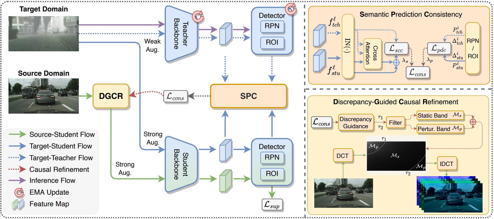

# <div align="center"> Domain Adaptive Object Detection via Dynamic Causal Refinement </div>

<div align="center">

Official codebase for [Domain Adaptive Object Detection via Dynamic Causal Refinement](https://icml.cc/virtual/2026/poster/66361)

**ICML26**



</div>

## Get started

<details open>
<summary><h3>Install</h3></summary>

**1. Clone this repository.**

```bash
git clone <REPO_URL>
cd Dynamic-Casual-Refinement
```

**2. Install Python and PyTorch.**  
The versions below come from our experimental environment and are provided only as a reference. Please choose Python/PyTorch versions that match your local CUDA and driver setup.

```bash
conda create -n dcr python=3.9 -y
conda activate dcr
pip install torch==2.1.0 torchvision==0.16.0 --index-url https://download.pytorch.org/whl/cu121
```

**3. Install this project in editable mode.**

```bash
pip install -e .
```

</details>

<details open>
<summary><h3>Datasets</h3></summary>

We use three adaptation benchmarks:

1. Cityscapes -> Foggy Cityscapes (C2F)  
2. Cityscapes -> BDD100K-daytime (C2B)  
3. Sim10k -> Cityscapes (S2C)

Recommended order:

1. Prepare dataset images and corresponding COCO-format JSON annotations.
2. Register your local paths in [`./dcr/datasets.py`](./dcr/datasets.py).

For step-by-step instructions (official benchmarks + custom datasets), see [`./docs/DATASETS.md`](./docs/DATASETS.md).

</details>

<details open>
<summary><h3>Training</h3></summary>

Our training follows two stages:

1. **Robust Start** (source-domain warm-up)  
2. **Adaptation** (domain adaptation with the DCR framework)

Training setup is defined in [`./configs/`](./configs/).  
We provide ready-to-run config/script groups for all three benchmarks (C2F, C2B, S2C) and both initialization choices (ImageNet, RegionCLIP).

You can directly launch training from prepared scripts:

```bash
# RegionCLIP initialization (C2F example)
bash ./train_scrips/cityscapes/regionclip/robust_start.sh
bash ./train_scrips/cityscapes/regionclip/dcr.sh
```

If you use **RegionCLIP** initialization, the robust-start configs expect this converted weight:

```bash
./models/regionclip_finetuned-coco_rn50_fpn.pth
```

We provide a converted checkpoint here: [`download link`](<REGIONCLIP_WEIGHT_DOWNLOAD_URL>).

If you want to customize training, use the following structure:

```bash
configs/
  cityscapes/   # C2F
    Base-RCNN-FPN-Cityscapes_robust_start-RegionCLIP.yaml/
    DCR-Cityscapes-to-FoggyCityscapes-RegionCLIP.yaml/
    ...
  bdd100k/      # C2B
    ...
  sim10k/       # S2C
    ...
train_scrips/
  cityscapes/
    imagenet/
    regionclip/
  bdd100k/
    ...
  sim10k/
    ...
```

For full training details and stage-by-stage notes, see [`./docs/TRAINING.md`](./docs/TRAINING.md).

</details>

<details open>
<summary><h3>Evaluation</h3></summary>

To evaluate a model, select:

1. a config file that matches the benchmark/backbone setting
2. a checkpoint path (`MODEL.WEIGHTS`)

Then run:

```bash
python tools/train_net.py --eval-only --config-file <CONFIG_PATH> MODEL.WEIGHTS <CHECKPOINT_PATH>
```

Examples:

```bash
# Evaluate your trained C2F RegionCLIP model
python tools/train_net.py --eval-only \
  --config-file ./configs/cityscapes/DCR-Cityscapes-to-FoggyCityscapes-RegionCLIP.yaml \
  MODEL.WEIGHTS ./output/dcr/cityscapes_to_foggy_cityscapes/regionclip_fpn/cityscapes_foggy_val_model_best.pth
```

</details>

## Reference

If you find this work useful, please cite: `TODO`

```bibtex
@article{<CITATION_KEY>,
  title={<PAPER_TITLE>},
  author={<AUTHORS>},
  journal={<VENUE>},
  year={<YEAR>},
  url={<PAPER_URL>}
}
```
